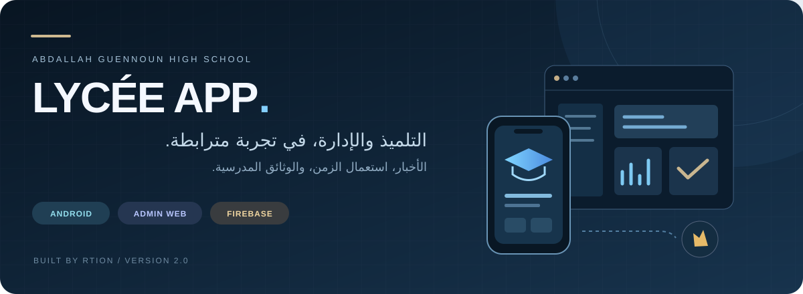
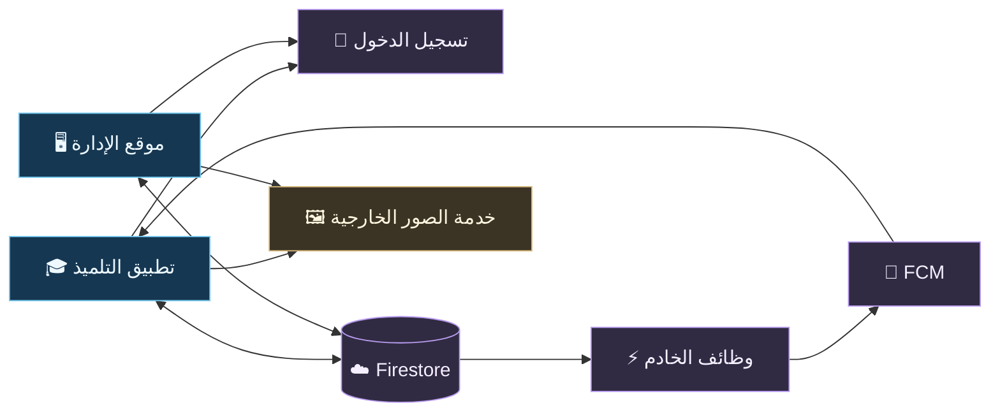

<p align="center"></p>



<p align="center"><a href="README.md">English</a> · <strong>العربية</strong></p>

<p align="center"><strong>مؤسسة واحدة. واجهتان. تجربة مترابطة.</strong><br>تطبيق Android للتلميذ، وموقع ويب للإدارة.<br>ثانوية عبد الله كنون — القليعة.</p>

---

## ✨ الحياة المدرسية، في مكان واحد

| 🎓 للتلميذ | 🖥️ للإدارة | ☁️ خلف التجربة |
| :--- | :--- | :--- |
| تسجيل الدخول وإدارة الملف الشخصي | مراجعة تسجيلات التلاميذ | Firebase Authentication |
| متابعة الأخبار والتوجيه | نشر الأخبار والتوجيه | Firestore وقواعد الوصول |
| الاطلاع على استعمال الزمن | تنظيم الأقسام والجداول | Firebase Hosting للموقع |
| طلب الوثائق وتتبع حالتها | معالجة طلبات الوثائق | مصدر وظائف إشعارات FCM |

التطبيق وموقع الإدارة مرتبطان بخدمات Firebase. التطبيق يفتح أيضاً المواقع التعليمية عبر Android System WebView، ورفع الصور يعتمد على خدمة خارجية مستقلة.

## 🧩 التقنيات المستعملة


| الجزء | التقنيات | الدور |
| :--- | :--- | :--- |
| **الهاتف** | Kotlin · Jetpack Compose · Android XML | شاشات التلميذ وسلوك التطبيق والموارد |
| **الويب** | HTML · CSS · JavaScript | موقع إدارة ثابت |
| **الخدمات** | Firebase Auth · Firestore · FCM | الحسابات والبيانات والإشعارات |
| **وظائف الخادم** | JavaScript · Node.js 22 | معالجة إشعارات نشر المحتوى |
| **البناء** | Gradle · Android Gradle Plugin | بناء التطبيق وإدارة المكتبات |

## 🗂️ خريطة المشروع

```text
lycee-app/
├── application/
│   └── AbdallahGuennoun/
│       ├── app/                 التطبيق والموارد والاختبارات
│       ├── firebase/            القواعد والفهارس ووظائف الخادم
│       └── gradle/              إعداد البناء وإصدارات المكتبات
├── administration/
│   └── Admin-Site-Web/
│       ├── public/              صفحات الإدارة والتصميم والصور
│       └── firebase.json        إعداد الاستضافة
├── docs/                        الأدلة وصور README
├── README.md                    النسخة الإنجليزية
├── README.ar.md                 النسخة العربية
├── FILE_INDEX.md                فهرس كل الملفات
└── .gitignore                   استثناء الملفات المحلية والمولدة
```

<details>
<summary><strong>من أين أبدأ قراءة الكود؟</strong></summary>

| ما تريد فهمه | الملف المناسب |
| :--- | :--- |
| نقطة تشغيل التطبيق | [MainActivity.kt](application/AbdallahGuennoun/app/src/main/java/com/otmanelabouze/abdallahguennoun/MainActivity.kt) |
| تسجيل الدخول والتحقق من الحساب | [AuthManager.kt](application/AbdallahGuennoun/app/src/main/java/com/otmanelabouze/abdallahguennoun/AuthManager.kt) |
| الرئيسية والتنقل | [StudentPortal.kt](application/AbdallahGuennoun/app/src/main/java/com/otmanelabouze/abdallahguennoun/StudentPortal.kt) |
| طلب الوثائق | [DocumentRequests.kt](application/AbdallahGuennoun/app/src/main/java/com/otmanelabouze/abdallahguennoun/DocumentRequests.kt) |
| مدخل موقع الإدارة | [index.html](administration/Admin-Site-Web/public/index.html) و[app.js](administration/Admin-Site-Web/public/app.js) |
| صلاحيات البيانات | [firestore.rules](application/AbdallahGuennoun/firebase/firestore.rules) |
| إشعارات النشر | [functions/](application/AbdallahGuennoun/firebase/functions/) |

</details>

## 🔄 كيف ترتبط الأجزاء؟



**مثال طلب وثيقة:** يقدّم التلميذ الطلب ← تعالجه الإدارة ← يتابع التلميذ حالته ← يستلم الوثيقة من المؤسسة. ملفات PDF الخاصة باستعمال الزمن خدمة مختلفة عن طلب الشهادة.

> **ملاحظة التشغيل:** المخطط يشرح بنية المصدر. وصول إشعارات Push يحتاج نشر وظائف الخادم وإعداد Firebase. خادم رفع الصور الخارجي غير مرفق بالمستودع.

## 🚀 البداية السريعة

### 01 · تطبيق Android

افتح **application/AbdallahGuennoun** في Android Studio، وثبّت SDK وJava المطابقين لإعدادات المشروع. دع Gradle ينزّل المكتبات، واضبط مسار SDK المحلي.

من جذر المستودع في PowerShell:

```powershell
cd application/AbdallahGuennoun
.\gradlew.bat :app:assembleDebug :app:testDebugUnitTest --console=plain
```

| إعدادات المصدر | القيمة |
| :--- | :--- |
| إصدار التطبيق | **2.0** · versionCode **6** |
| Android | minSdk **26** · targetSdk **37** · compileSdk **37 / minor 1** |
| معمارية الجهاز | **arm64-v8a** |
| أدوات البناء | Gradle **9.7.1** · AGP **9.4.1** · Kotlin **2.4.10** |
| Java | مشغّل Gradle **25** · source/target **17** |

على Linux/macOS نفّذ `chmod +x gradlew` واستعمل `./gradlew`. نواتج APK تتولد داخل `app/build/outputs/apk/`. نسخة التوزيع النهائية تحتاج إعداد توقيع المالك.

### 02 · موقع الإدارة

من جذر المستودع، مع وجود Python:

```powershell
cd administration/Admin-Site-Web
python -m http.server 8080 --directory public
```

افتح **http://localhost:8080**. الموقع ثابت ولا يحتاج npm build. تسجيل الدخول والوصول للبيانات يحتاجان إعداد Firebase وحساباً مخولاً.

### 03 · Firebase ووظائف الخادم

إعداد Android موجود في `app/google-services.json`، وإعداد الويب في `public/firebase-config.js`. عند استعمال مشروع Firebase آخر، حدّثهما مع ربط الاستضافة. جهّز تسجيل Google والنطاقات المسموح بها وبصمات توقيع Android وأدوار الحسابات.

باستعمال Node.js 22 وpnpm، ومن جذر المستودع:

```powershell
cd application/AbdallahGuennoun/firebase/functions
pnpm install --frozen-lockfile
pnpm test
```

رفع الكود لا ينشر خدمات Firebase ولا ينسخ البيانات السحابية. أوامر نشر الاستضافة والقواعد والوظائف موجودة في [دليل الإعداد](docs/SETUP.md).

## 📚 دليل القراءة

| الدليل | المحتوى |
| :--- | :--- |
| [English README](README.md) | المقدمة الكاملة باللغة الإنجليزية |
| [بنية المشروع](docs/ARCHITECTURE.md) | الأجزاء والملفات الرئيسية ودورة البيانات |
| [الإعداد والتشغيل](docs/SETUP.md) | البيئة والبناء والاختبارات والنشر |
| [الخدمات الخارجية](docs/EXTERNAL-SERVICES.md) | ما يحتاجه المشروع خارج ملفات المصدر |
| [التحقق](docs/VERIFICATION.md) | فحوص التغليف وحدود الاختبارات |
| [فهرس الملفات](FILE_INDEX.md) | كل ملف ودوره |

<details>
<summary><strong>محتويات النسخة، حالة الخدمات، والحقوق</strong></summary>

النسخة تتضمن المصدر والموارد الأصلية والاختبارات وGradle Wrapper وملفات تعريف المكتبات. مخرجات البناء والكاش والمكتبات المثبتة وإعدادات SDK المحلية والنسخ الاحتياطية مستثناة.

الحسابات وبيانات التلاميذ السحابية ليست مرفقة. إعدادات Firebase العميل محفوظة؛ وهي ليست بيانات حساب خدمة إداري. خادم رفع الصور ومفاتيح التوقيع الخاصة غير مرفقة. الوثائق السابقة أشارت إلى اشتراط خطة فوترة لنشر وظائف الإشعارات؛ لم يُعد التحقق من حالة النشر الفعلية أثناء التغليف.

لم يُضف ترخيص جديد. راجع مالك المشروع بشأن إعادة الاستخدام والتوزيع، واحتفظ بـ[إشعارات الطرف الثالث](application/AbdallahGuennoun/THIRD_PARTY_NOTICES.md).

</details>

---

<p align="center"><strong>تطوير RTION · Otman Elabouze</strong><br><sub>ثانوية عبد الله كنون · القليعة</sub><br><a href="README.md">Read in English →</a></p>
