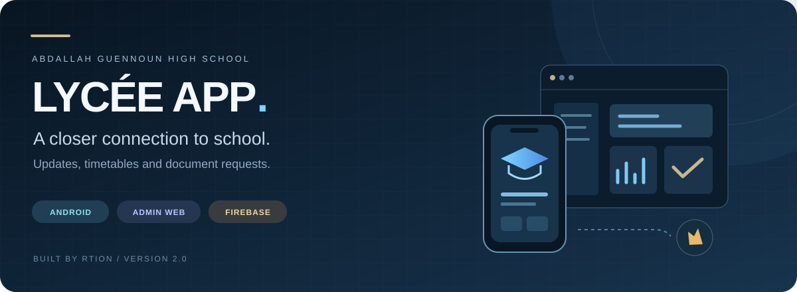
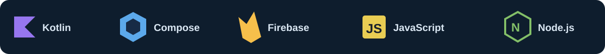
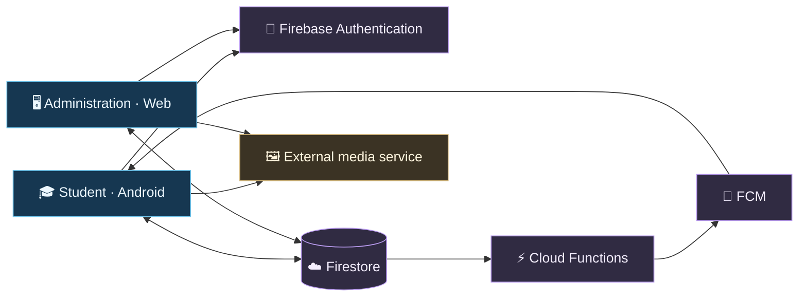

<p align="center"></p>



<p align="center"><strong>English</strong> · <a href="README.ar.md">العربية</a></p>
<p align="center"><a href="#-quick-start">Quick start</a> &nbsp;·&nbsp; <a href="#-inside-the-project">Project map</a> &nbsp;·&nbsp; <a href="#-documentation">Documentation</a></p>

<p align="center"><strong>One school. Two interfaces. A connected experience.</strong><br>Android for students. A web workspace for administration.<br>Made for Abdallah Guennoun High School, El Qliâa.</p>

---

## ✨ School life, brought together

| 🎓 For students | 🖥️ For administration | ☁️ Behind the experience |
| :--- | :--- | :--- |
| Sign in and manage a student profile | Review student registrations | Firebase Authentication |
| Follow school news and guidance | Publish news and guidance | Firestore data and access rules |
| View class timetables | Organize classes and timetables | Firebase Hosting for the web portal |
| Request documents and track progress | Process and track document requests | FCM notification function source |

The Android app and administration website share Firebase services. The app also opens educational websites through Android System WebView. Media uploads use a separate external service.

## 🧩 Built with



| Layer | Technology | Purpose |
| :--- | :--- | :--- |
| **Mobile** | Kotlin · Jetpack Compose · Android XML | Student screens, app behavior and resources |
| **Web** | HTML · CSS · JavaScript | A static administration website |
| **Services** | Firebase Auth · Firestore · FCM | Identity, data access and notifications |
| **Server functions** | JavaScript · Node.js 22 | Publication notification handling |
| **Build** | Gradle · Android Gradle Plugin | Android builds and dependency management |

## 🗂️ Inside the project

```text
lycee-app/
├── application/
│   └── AbdallahGuennoun/       Android Studio project
│       ├── app/               Kotlin source, resources and tests
│       ├── firebase/          Rules, indexes, functions and tests
│       └── gradle/            Wrapper and dependency versions
├── administration/
│   └── Admin-Site-Web/         Administration website
│       ├── public/            HTML, CSS, JavaScript and images
│       └── firebase.json      Hosting configuration
├── docs/                      Guides and README artwork
├── README.md                  English introduction
├── README.ar.md               المقدمة بالعربية
├── FILE_INDEX.md              Complete file-by-file index
└── .gitignore                 Local and generated file exclusions
```

<details>
<summary><strong>Where should I start reading the code?</strong></summary>

| What you want to understand | Start here |
| :--- | :--- |
| App entry point | [MainActivity.kt](application/AbdallahGuennoun/app/src/main/java/com/otmanelabouze/abdallahguennoun/MainActivity.kt) |
| Sign-in and account checks | [AuthManager.kt](application/AbdallahGuennoun/app/src/main/java/com/otmanelabouze/abdallahguennoun/AuthManager.kt) |
| Student home and navigation | [StudentPortal.kt](application/AbdallahGuennoun/app/src/main/java/com/otmanelabouze/abdallahguennoun/StudentPortal.kt) |
| Document requests | [DocumentRequests.kt](application/AbdallahGuennoun/app/src/main/java/com/otmanelabouze/abdallahguennoun/DocumentRequests.kt) |
| Administration entry point | [index.html](administration/Admin-Site-Web/public/index.html) and [app.js](administration/Admin-Site-Web/public/app.js) |
| Data permissions | [firestore.rules](application/AbdallahGuennoun/firebase/firestore.rules) |
| Notification delivery logic | [functions/](application/AbdallahGuennoun/firebase/functions/) |

</details>

## 🔄 How it connects



**A typical document request:** a student submits a request → staff process it → the student follows its status → the document is collected at school. This is separate from timetable PDFs.

> **Deployment note:** the diagram describes the source architecture. Push notifications require deployed functions and a configured Firebase project. The external media server is not included in this repository.

## 🚀 Quick start

### 01 · Android app

Open **application/AbdallahGuennoun** in Android Studio. Install the SDK and Java toolchain specified by the project, let Gradle download dependencies, and configure the local SDK path.

From the repository root, in PowerShell:

```powershell
cd application/AbdallahGuennoun
.\gradlew.bat :app:assembleDebug :app:testDebugUnitTest --console=plain
```

| Source configuration | Value |
| :--- | :--- |
| App version | **2.0** · versionCode **6** |
| Android | minSdk **26** · targetSdk **37** · compileSdk **37 / minor 1** |
| Architecture | **arm64-v8a** |
| Toolchain | Gradle **9.7.1** · AGP **9.4.1** · Kotlin **2.4.10** |
| Java | Gradle daemon **25** · source/target **17** |

On macOS/Linux, run `chmod +x gradlew` and use `./gradlew`. APK build outputs are generated under `app/build/outputs/apk/`. Distribution builds require the owner's signing configuration.

### 02 · Administration website

From the repository root, with Python installed:

```powershell
cd administration/Admin-Site-Web
python -m http.server 8080 --directory public
```

Open **http://localhost:8080**. The site is static; no npm build step is needed. Authentication and data access still require Firebase configuration and an authorized account.

### 03 · Firebase & server functions

The Android client configuration is in `app/google-services.json`; the web configuration is in `public/firebase-config.js`. When using a different Firebase project, update both and the Hosting project binding. Configure Google sign-in, authorized domains, Android signing fingerprints and Firestore roles.

Using Node.js 22 and pnpm, from the repository root:

```powershell
cd application/AbdallahGuennoun/firebase/functions
pnpm install --frozen-lockfile
pnpm test
```

Publishing the source does not deploy Firebase services or copy cloud data. See the [setup guide (Arabic)](docs/SETUP.md) for Hosting, Firestore and functions deployment commands.

## 📚 Documentation

| Guide | What you will find |
| :--- | :--- |
| [العربية — Arabic README](README.ar.md) | A complete Arabic version of this introduction |
| [Architecture](docs/ARCHITECTURE.md) · Arabic | Components, key files and data flow |
| [Setup](docs/SETUP.md) · Arabic | Environment, builds, tests and deployment |
| [External services](docs/EXTERNAL-SERVICES.md) · Arabic | Dependencies outside this source package |
| [Verification](docs/VERIFICATION.md) · Arabic | Packaging checks and testing limitations |
| [File index](FILE_INDEX.md) · Arabic | Every included file and its role |

<details>
<summary><strong>Package contents, service status & rights</strong></summary>

Source, original media assets, tests, Gradle Wrapper and dependency declarations are included. Generated builds, installed dependencies, caches, local SDK settings and backup files are excluded.

Cloud accounts and student data are not bundled. Client Firebase configuration is retained; it is not an administrative service-account credential. The media upload server and private signing keys are not included. Earlier project notes reported a Firebase billing-plan requirement for deploying notification functions; live deployment status has not been rechecked during packaging.

No new license has been added. Ask the project owner about reuse and distribution, and retain the [third-party notices](application/AbdallahGuennoun/THIRD_PARTY_NOTICES.md).

</details>

---

<p align="center"><strong>Built by RTION · Otman Elabouze</strong><br><sub>Abdallah Guennoun High School · El Qliâa</sub><br><a href="README.ar.md">اقرأ بالعربية ←</a></p>
